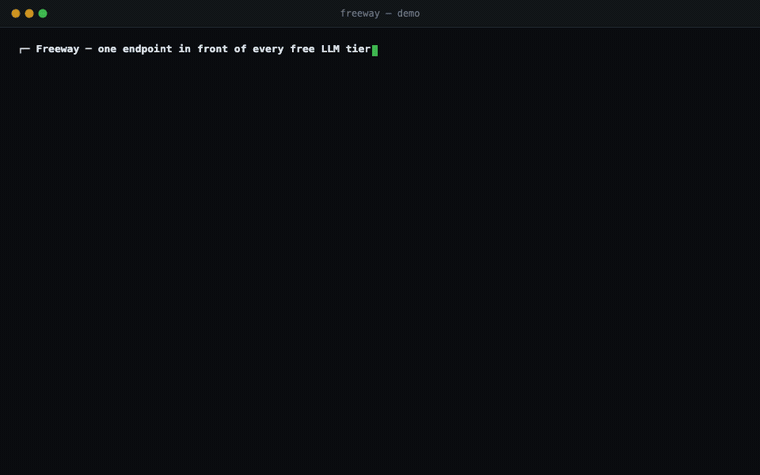
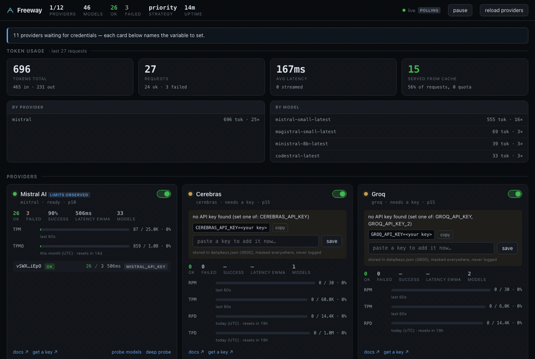

# Freeway

A self-hosted, OpenAI-compatible gateway in front of every free-tier LLM
provider. One endpoint, automatic failover, live quota visibility, and no real
provider key ever leaving the box.

Your apps point at `http://localhost:8787/v1` and never see a provider key. When
one free tier runs out, the next one takes over — mid-conversation, even if it
has a sixteenth of the context window.



**The dashboard, reacting to that same traffic:**



*Both are real. The terminal is `./scripts/demo.sh`; the dashboard is headless
Chrome screenshotting the actual page via `node scripts/record-dashboard.mjs`,
between real requests. Watch the token totals, cache hit rate and per-model
counts climb — nothing is mocked up.*

```
your app ──▶ Freeway ──┬──▶ Mistral        1B tokens/month
                       ├──▶ Cloudflare     10k neurons/day
                       ├──▶ Groq           30 rpm, very fast
                       ├──▶ Cerebras       1M tokens/day
                       └──▶ …8 more, each one JSON file
```

---

## 60-second quickstart

```bash
git clone <your-fork> freeway && cd freeway
npm install && npm run build

cp .env.example .env      # fill in whatever keys you have; none are required
npm start
```

Open <http://localhost:8787> for the dashboard, then:

```bash
curl localhost:8787/v1/chat/completions \
  -H 'content-type: application/json' \
  -d '{"model":"auto","messages":[{"role":"user","content":"hello"}]}' -D-
```

```
HTTP/1.1 200 OK
x-freeway-provider: mistral          ← who served it
x-freeway-model: mistral-small-latest
x-freeway-route: auto                ← how the model string was resolved
x-freeway-attempts: 1
x-freeway-ms: 412
```

Or with Docker:

```bash
docker compose up -d
```

No keys yet? It still starts. Every provider shows up in the dashboard as a card
telling you exactly which variable to set and where to get one.

---

## Adding a provider

**This is the headline feature, so it gets the headline section.**

Adding a provider is **one JSON file plus one environment variable**. Never a
code change. The gateway ships with twelve providers already written — most are
just waiting for a key.

### A provider that's already bundled

Set the variable and reload. That's the whole procedure.

```bash
echo 'GROQ_API_KEY=gsk_...' >> .env
curl -X POST localhost:8787/api/reload
```

Or paste it straight into the dashboard card — it writes `data/keys.json` at
mode `0600`, masks it everywhere, never logs it, and probes the key immediately
to show you which models it can reach.

### A provider nobody has heard of

```bash
node scripts/new-provider.mjs acme --url https://api.acme.ai/v1 --env ACME_API_KEY
export ACME_API_KEY=sk-...
node scripts/verify-provider.mjs acme
```

The verifier is the feedback loop:

```
1. file
  ✓ providers/acme.json parses
2. environment
  ✓ baseUrl resolves to https://api.acme.ai/v1
  ✓ 1 key in the pool: sk-l…xxxx (ACME_API_KEY)
3. live probe
  ✓ auth accepted (142ms)
  ✓ discovery found 3 models via /models → data[].id
4. limits
  ✓ observed from response headers: rpm=60, tpm=40000
  + rpm: file says null, provider reports 60 — consider recording it
5. suggested edits
  { "models": [...], "limits": {...}, "limitsSource": "observed" }

PASS — 0 problems, 0 warnings
```

Paste the suggestion in, re-run, done. Add `--validate` to send a one-token
request per model and see which ones the key can genuinely reach. Add `--json`
if you're an agent.

### The file itself

```jsonc
{
  "id": "acme",
  "baseUrl": "https://api.acme.ai/v1",     // ${ENV_VAR} works here
  "auth": { "type": "bearer", "envKeys": ["ACME_API_KEY"] },
  "limits": { "rpm": 60, "tpm": null },    // null = unknown; NEVER guess
  "modelsPath": "data[].id",               // for non-OpenAI response shapes
  "models": [
    { "id": "acme-turbo", "alias": ["fast"], "context": 128000, "caps": ["chat", "tools"] }
  ]
}
```

Full walkthrough, including every escape hatch for odd providers:
**[docs/ADDING-A-PROVIDER.md](docs/ADDING-A-PROVIDER.md)**.
Machine-readable contract: [`providers/_schema.json`](providers/_schema.json).

> **On `null` limits.** A `null` means "unknown or unlimited" and is always
> better than a guess: the guard layer overwrites nulls with values read from
> the provider's own rate-limit response headers, so an honest null becomes
> accurate on its own. A wrong number never self-corrects. Mistral ships with
> `null` rps and tpm for exactly this reason — they stopped publishing them.

### Bundled catalog

| Provider | Free tier | Variable |
|---|---|---|
| Mistral | ~1B tokens/month, phone verification | `MISTRAL_API_KEY` |
| Cloudflare Workers AI | 10,000 neurons/day | `CLOUDFLARE_ACCOUNT_ID` + `CLOUDFLARE_API_TOKEN` |
| Groq | ~30 rpm / 14.4k rpd, very fast | `GROQ_API_KEY` |
| Cerebras | ~1M tokens/day | `CEREBRAS_API_KEY` |
| Google AI Studio | ~15 rpm / 1500 rpd, multimodal · not in EU/UK/CH | `GOOGLE_AI_API_KEY` |
| OpenRouter | `:free` models only | `OPENROUTER_API_KEY` |
| GitHub Models | needs `models:read` scope | `GITHUB_MODELS_TOKEN` |
| Together | `-Free` models only | `TOGETHER_API_KEY` |
| Hugging Face | small monthly credits | `HF_TOKEN` |
| NVIDIA NIM | credits, not a free tier | `NVIDIA_API_KEY` |
| Scaleway | EU-hosted (Paris) | `SCALEWAY_API_KEY` |
| Ollama | your own machine | `OLLAMA_HOST` |

---

## Aliases

Point at a capability, not a vendor. Several providers sharing an alias is what
makes failover work.

```bash
curl … -d '{"model":"fast", …}'      # whichever fast model is healthy
curl … -d '{"model":"auto", …}'      # anything that can serve this request
```

| Model string | Meaning |
|---|---|
| `auto`, `freeway`, `""` | any healthy chat model under quota |
| `fast`, `cheap`, `big`, `code` | aliases from `freeway.config.json` or a provider file |
| `mistral/mistral-small-latest` | pin one model |
| `mistral/*` | pin a provider, any model |
| `llama-3.1-8b` | fuzzy — finds `@cf/meta/llama-3.1-8b-instruct` |

Model ids are split on the **first** slash only, so Cloudflare's
`@cf/meta/llama-3.1-8b-instruct` survives being pinned.

---

## Strategies

Set `strategy` in `freeway.config.json` or `FREEWAY_STRATEGY`.

| Strategy | Picks | Use when |
|---|---|---|
| `priority` | lowest `priority` number first | you have a preferred provider (default) |
| `round-robin` | rotates between calls | you want to spread load evenly |
| `least-used` | emptiest quota window | you want to drain every free tier evenly |
| `fastest` | lowest EWMA latency | latency matters more than which provider |

`fastest` uses optimistic initialisation — an untried provider sorts first so it
gets sampled once and earns a real number, rather than never being tried.

---

## Failover

Walks candidates up to `maxAttempts` (default 3). What gets benched depends on
what went wrong, and getting this wrong is what makes key pools useless:

| Upstream says | Blame | Effect |
|---|---|---|
| 401, 403 | **the key** | bench that key for 15+ min; the pool's others still serve |
| 429 | **the key** | bench that key for `Retry-After`; try the next key |
| 5xx, timeout, network | **the provider** | bench the provider; skip its other keys |
| 400, 404, 422 | **the request** | return immediately — it fails identically everywhere |

When nothing is viable you get a 429 whose body *is* the diagnosis:

```json
{ "error": { "code": "all_providers_blocked" },
  "freeway": { "retryAfterMs": 23410, "blocked": [
    { "provider": "mistral", "reason": "tpm limit reached (500.0K/500.0K last 60s)" },
    { "provider": "cloudflare", "reason": "all 2 keys unavailable — cloudflare#0 (cf-t…9a21) cooling down for 24s: 429" }
  ]}}
```

---

## Sessions and the context engine

Send a `session` id and only the new message. The gateway rebuilds the thread —
and reshapes it to fit whichever model actually serves the call.

```bash
curl localhost:8787/v1/chat/completions -H 'content-type: application/json' -d '{
  "session": "proj-42", "model": "auto",
  "messages": [{"role":"user","content":"and now?"}]
}'
```

```
x-freeway-provider: cloudflare
x-freeway-model: @cf/meta/llama-3.1-8b-instruct
x-freeway-context: refit=compact tokens=41200->7100 kept=8 dropped=52 summaries=1
```

That's a 128k conversation continuing on an 8k model. The refit runs **per
candidate**, after the router picks one — each has a different window, so a
history that fit Mistral has to be reshaped again on failover.

The ladder escalates only as far as it must:

| Rung | Does | Costs |
|---|---|---|
| `passthrough` | nothing; it already fits | — |
| `drop-tool-noise` | clears stale tool results, leaves a marker | free |
| `window` | keeps system + first turn + last N turns | free |
| `compact` | summarises the dropped middle | one LLM call, cached forever by range |
| `hard-truncate` | deterministic character-level cut | free, always terminates |

Guarantees: the system message always survives; a tool call is never split from
its result; the newest user message is never mangled — if it alone exceeds the
window you get a **413** saying so. And if a summary comes back *longer* than
what it replaced (a real failure mode), it's discarded and the ladder escalates.

Sessions are optional. Omit the id and it's a plain OpenAI endpoint.

---

## Cache

| Tier | Default | Cost of a miss |
|---|---|---|
| exact | on (`safe`) | nothing |
| semantic | **off** | one embedding call |

`safe` mode caches only deterministic requests — `temperature <= 0.2` or an
explicit `seed`. Replaying a `temperature: 0.9` answer would turn a creative
endpoint into a broken record, so it doesn't.

Semantic caching embeds the newest user turn through your *own* `/v1/embeddings`
(Cloudflare `bge-large` by default), stores a normalised vector in a flat
`Float32Array`, and matches on cosine similarity above `0.92`. 5k entries at
1024 dims is ~20 MB — no vector database. Entries are scoped by resolved model
set **and** system prompt, so a "you are a pirate" answer can never be served
under "you are a lawyer".

Cache hits cost no quota and are logged distinctly. A cached stream replays as
SSE, so a client can't tell.

```json
"cache": { "mode": "safe", "semantic": { "enabled": true, "threshold": 0.92 } }
```

---

## Rate limiting and threat analysis

| Piece | What it does |
|---|---|
| **inbound limiter** | per-virtual-key and per-IP rpm/tpm/rpd/concurrency. Stops one runaway app draining every free tier |
| **quota forecasting** | `mistral: tpmo exhausted in ~4h at current burn` — a trajectory, not a level |
| **calibration** | learns real limits from `x-ratelimit-*` headers and overwrites `null`s |
| **tier drift** | flags a provider enforcing *less* than its file claims — a silently downgraded key |
| **key health** | re-probes every 6h: valid / revoked / forbidden / unreachable |
| **content scanning** | regex tripwires for leaked secrets, PII (Luhn-checked cards), and prompt injection |

Scanning is `flag` by default and only *blocks* on high-severity findings even
in `block` mode — failing a request over a stray email address would make the
mode unusable. Findings store the match **redacted**; a scanner that logs the
secret it found has done more damage than the thing it was watching for.

All of it surfaces at `GET /api/alerts` and in the dashboard's Alerts panel.

---

## SDK

```bash
npm i @freeway/sdk
```

```ts
import { createFreeway } from '@freeway/sdk';
const fw = createFreeway({ baseUrl: 'http://localhost:8787/v1', apiKey: 'fw-…' });

await fw.chat('summarize this', { model: 'fast' });        // → string
const res = await fw.chat.raw({ model: 'auto', messages }); // → full response
res.route.provider;                                         // → 'mistral'

for await (const text of fw.streamText({ model: 'fast', messages })) process.stdout.write(text);
await fw.embed(['a', 'b']);                                 // → number[][]
await fw.models();
```

Already using the OpenAI SDK? Drop it in:

```ts
import OpenAI from 'openai';
const openai = new OpenAI(fw.openai());   // { baseURL, apiKey }
```

Errors carry the diagnosis:

```ts
catch (err) {
  if (err instanceof FreewayError) {
    err.blocked;        // per-provider reasons
    err.retryAfterMs;
    err.suggestions;    // on a 404
  }
}
```

---

## Dashboard

<http://localhost:8787> — one self-contained HTML file. No framework, no build
step, no CDN (there's a test asserting it references nothing external).

Provider cards with health dots, EWMA latency, per-key state and masked keys ·
quota bars coloured by fill with reset countdowns · unconfigured providers shown
as cards with the variable to set and a paste box · searchable model catalog ·
alerts panel · **a live request log pushed over SSE**, not polled — entries
appear the instant a request completes, with failed attempts expandable.

---

## Environment variables

| Variable | Default | Meaning |
|---|---|---|
| `FREEWAY_KEYS` | *empty* | **inference-only** `fw-` keys apps present (`/v1/*`). Empty = open, and the gateway then refuses to bind anything but loopback |
| `FREEWAY_ADMIN_KEY` | — | **full access** (`/api/*`): stored conversations, provider credentials, config. Never give this to an app |
| `FREEWAY_CORS_ORIGINS` | *empty* | browser origins allowed to call the gateway. `*` is rejected |
| `HOST` / `PORT` | `127.0.0.1` / `8787` | bind address |
| `FREEWAY_STRATEGY` | `priority` | routing strategy |
| `FREEWAY_ROOT` | cwd | base for the paths below |
| `FREEWAY_PROVIDERS` | `./providers` | provider JSON directory |
| `FREEWAY_DATA` | `./data` | quota counters, sessions, cache, pasted keys |
| `FREEWAY_CONFIG` | `./freeway.config.json` | config file |
| *provider keys* | — | see [.env.example](.env.example) |

A `.env` file in `FREEWAY_ROOT` is read at startup. A real environment variable
always wins over the file.

---

## Exposing it

Read **[SECURITY.md](SECURITY.md)** first. The short version:

```bash
FREEWAY_KEYS=fw-app-one,fw-app-two   # one per app — inference only
FREEWAY_ADMIN_KEY=fw-admin-…         # separate, never given to an app
```

Then put TLS in front — Freeway speaks plain HTTP by design.

Inference keys reach `/v1/*` and nothing else. `/api/*` reads stored
conversations and writes provider credentials, so it needs the admin key; with
no admin key set it is allowed on loopback and refused everywhere else. Binding
a public interface also switches on inbound rate limits automatically, and the
gateway flatly refuses to bind one with no keys at all.

---

## Development

```bash
./scripts/demo.sh                     # scripted walkthrough against your providers
node scripts/record-dashboard.mjs     # re-record the dashboard GIF
npm run build           # tsc --build, must be clean
npm test                # node:test across all workspaces
npm run smoke           # every route against mock upstreams — run this after adding a provider
npm run mock -- --port 9101 --name alpha   # a fake provider you control
```

`scripts/mock-upstream.js` is the reason all of this is testable without
spending quota: scenario-scripted status codes, per-key behaviour, injectable
rate-limit headers, SSE, and a `POST /__control` plane to re-script it mid-test.

Working on this with an AI agent? Start it at [CLAUDE.md](CLAUDE.md).

**Zero runtime dependencies.** Dev deps are `typescript` and `@types/node`.
Everything else is `node:http`, `node:sqlite`, `fetch`, and `node:test`.

---

## Out of scope

No user accounts, billing, multi-tenancy, external database, React frontend, or
prompt templating. This is a personal gateway. If a users table appears,
something went wrong.
